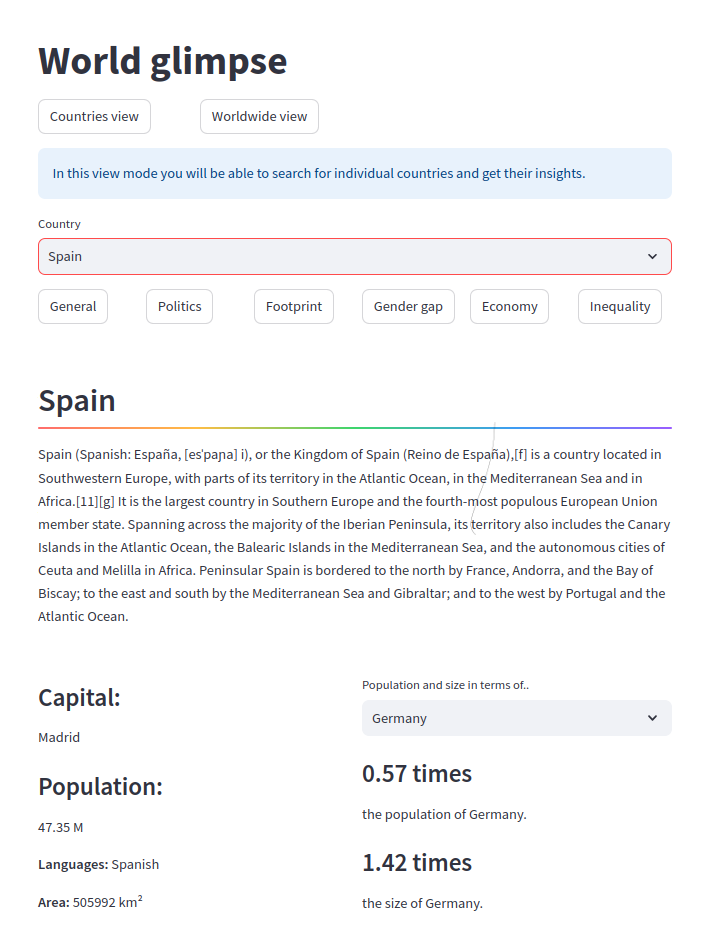
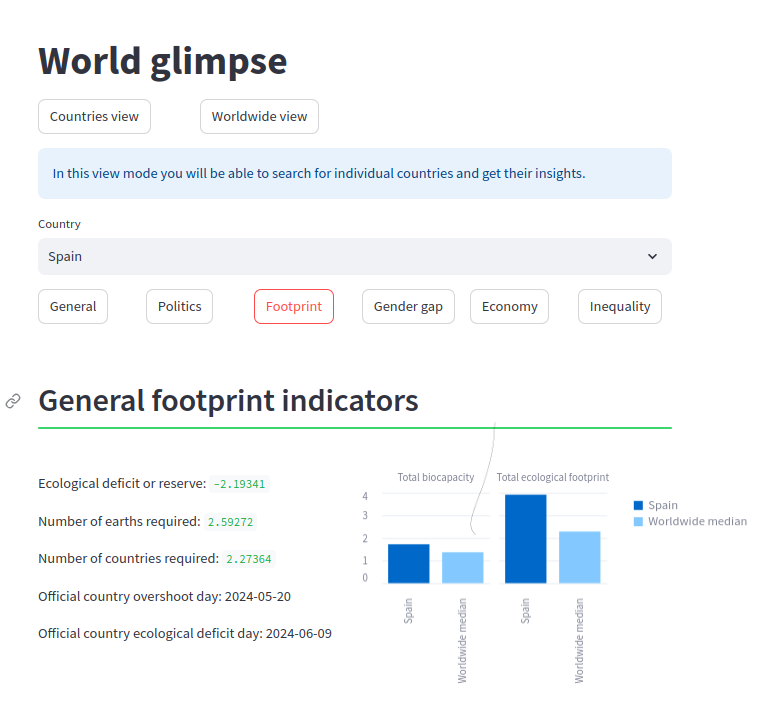
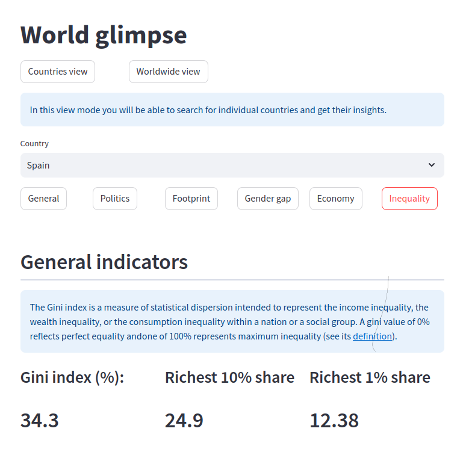
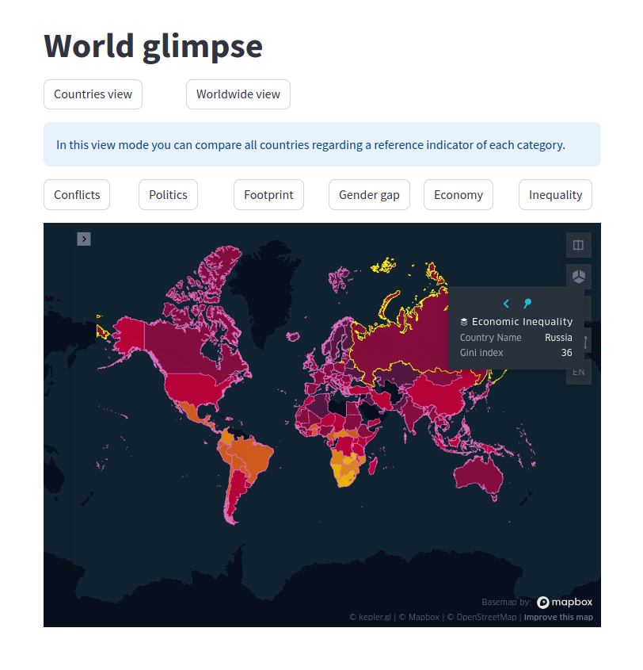

# World_glimpse

Hey there! Welcome to the repo of my final proyect of the Ironhack Data Analytics course in Madrid: World Glimpse.

World Glimpse is an api built-on project with a front-end to explore different aspects of world countries and regions to get an overall idea of their characteristics and current situation. Some aspects that are included are:

+ General: Main spoken langguages, demographic population, size.
+ Social: Well-being and social indicators, such as the poverty index or the sexism rating.
+ Political: Government system, on-going conflicts if existing, etc.
+ Economical: relative power adquisition indexes such as PPP, economic proportions.

A subsection of news for each country is also included, based on calls to the World News API.

# About the front-end part:

The front-end was built with streamlit. It contains two main views, the individual countries view and the worldwide map comparison view.

# Countries view

It allows an insight to any individual country selected. Here are some examples of some sections:

## General information:

## Ecological footprint:

## Economic inequality:

# Worldwide view:

A color-filled kepler map is rendered to allow a comparison among countries with the most significant index or quantity of each category:

